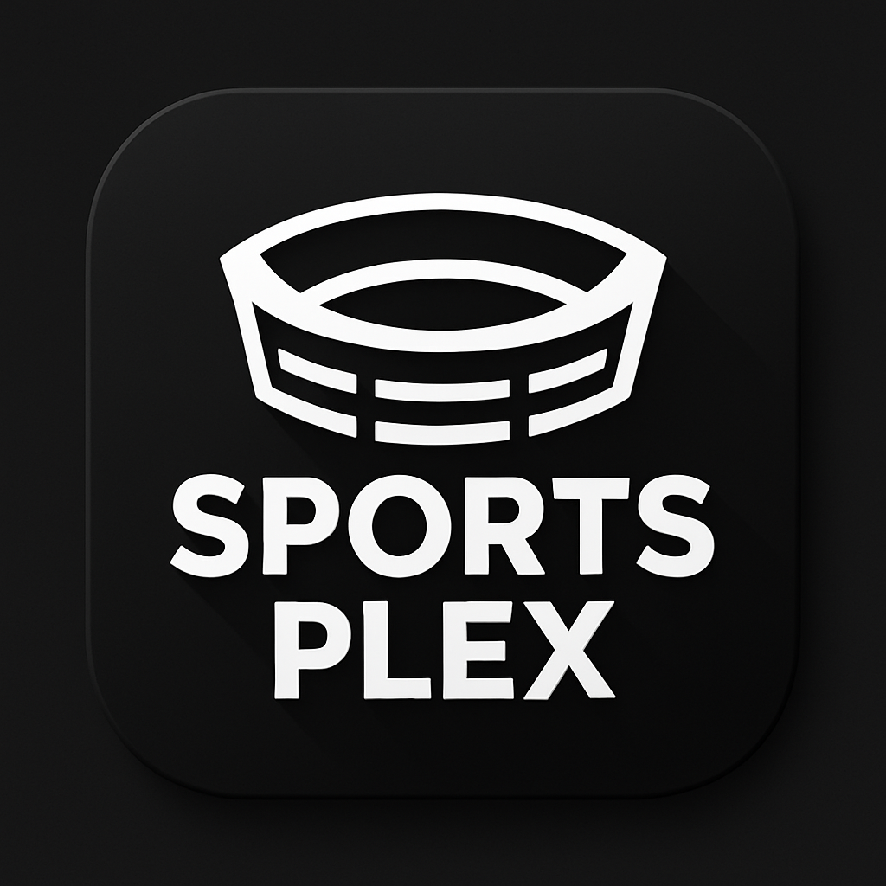

# 🏟️ SportsPlex - University Sports Complex Management System

<p align="center">
  
</p>

**SportsPlex** is a comprehensive sports complex management system designed for university campuses (specifically CHARUSAT). It provides a complete solution for managing sports equipment, clubs, matches, events, and announcements with role-based access control.

---

## 📋 Table of Contents

- [Features](#-features)
- [Tech Stack](#-tech-stack)
- [Project Structure](#-project-structure)
- [Installation](#-installation)
- [Usage](#-usage)
- [API Endpoints](#-api-endpoints)
- [User Roles](#-user-roles)
- [Screenshots](#-screenshots)
- [Contributing](#-contributing)

---

## ✨ Features

### 🎯 Core Features

- **User Authentication** - Email/Password and Google Sign-In with Firebase
- **Role-Based Access Control** - Three user roles: Student, Student Head, Admin
- **Equipment Management** - Track, allocate, and request sports equipment
- **Club Management** - Create and manage sports clubs with member tracking
- **Match Management** - Schedule matches with live scoring functionality
- **Event Management** - Create and manage sports events and tournaments
- **Announcements** - Broadcast important updates to users
- **Profile Management** - User profiles with certificate uploads

### 👥 Role-Specific Features

#### Students
- View and request sports equipment
- Browse and join sports clubs
- View upcoming matches and events
- Access announcements
- Request Student Head role promotion

#### Student Heads
- All student features
- Manage club activities
- Update live match scores
- Create club-specific announcements

#### Administrators
- Full system access
- User management and role assignment
- Equipment inventory management
- Approve/reject student head requests
- Create and manage all clubs, matches, and events
- System-wide announcements
- Analytics dashboard

---

## 🛠️ Tech Stack

### Frontend (Web - React)
| Technology | Purpose |
|------------|---------|
| React 19 | UI Framework |
| React Router DOM 7 | Navigation |
| Material UI | Component Library |
| Tailwind CSS | Styling |
| Axios | HTTP Client |
| Firebase | Authentication |
| Lucide React | Icons |
| React Hook Form + Zod | Form Handling & Validation |

### Frontend (Mobile - Flutter)
| Technology | Purpose |
|------------|---------|
| Flutter 3.8+ | Cross-platform Mobile Framework |
| HTTP | API Requests |
| Table Calendar | Calendar Widget |
| Font Awesome | Icons |

### Backend (Node.js)
| Technology | Purpose |
|------------|---------|
| Express 5 | Web Framework |
| MongoDB Atlas | Database |
| Mongoose | ODM |
| JWT | Authentication |
| Bcrypt.js | Password Hashing |
| Multer | File Uploads |
| Firebase Admin | Google Auth Verification |

---

## 📁 Project Structure

```
SportsPlex2/
├── 📂 backend/                    # Node.js Express Backend
│   ├── 📂 controllers/            # Request handlers
│   │   ├── announcementController.js
│   │   ├── authController.js
│   │   ├── equipmentController.js
│   │   └── matchController.js
│   ├── 📂 middleware/             # Express middleware
│   │   ├── authMiddleware.js
│   │   └── equipmentUpload.js
│   ├── 📂 models/                 # Mongoose schemas
│   │   ├── announcement.js
│   │   ├── club.js
│   │   ├── equipment.js
│   │   ├── event.js
│   │   ├── match.js
│   │   └── user.js
│   ├── 📂 routes/                 # API routes
│   ├── 📂 services/               # Business logic
│   ├── 📂 uploads/                # File storage
│   └── server.js                  # Entry point
│
├── 📂 src/                        # React Web Frontend
│   ├── 📂 components/             # Reusable components
│   │   ├── 📂 Bookings/
│   │   ├── 📂 Layout/
│   │   ├── 📂 Matches/
│   │   ├── 📂 Modals/
│   │   └── 📂 StudentHead/
│   ├── 📂 pages/                  # Page components
│   │   ├── AdminDashboard.js
│   │   ├── UserDashboard.js
│   │   ├── Login.js
│   │   ├── Register.js
│   │   └── ... (40+ pages)
│   ├── 📂 context/                # React Context
│   ├── 📂 services/               # API services
│   └── 📂 hooks/                  # Custom hooks
│
├── 📂 sportsplex/                 # Flutter Mobile App
│   ├── 📂 lib/                    # Dart source files
│   │   ├── main.dart
│   │   ├── AdminDashboard.dart
│   │   ├── StudentDashboard.dart
│   │   └── ... (20+ screens)
│   ├── 📂 android/                # Android config
│   ├── 📂 ios/                    # iOS config
│   └── 📂 assets/                 # Images & icons
│
├── 📂 Firebase/                   # Firebase configuration
└── 📂 public/                     # Static assets
```

---

## 🚀 Installation

### Prerequisites

- Node.js 18+
- npm or yarn
- MongoDB Atlas account
- Firebase project
- Flutter SDK (for mobile app)

### Backend Setup

```bash
# Navigate to backend directory
cd backend

# Install dependencies
npm install

# Start the server
node server.js
```

The backend will run on `http://localhost:5000`

### Frontend (React Web) Setup

```bash
# From project root
npm install

# Start development server
npm start
```

The web app will run on `http://localhost:3000`

### Mobile App (Flutter) Setup

```bash
# Navigate to Flutter directory
cd sportsplex

# Get dependencies
flutter pub get

# Run on connected device/emulator
flutter run
```

---

## 📱 Usage

### Getting Started

1. **Register** - Create an account with email or Google Sign-In
2. **Complete Profile** - Fill in required details (Roll No, College, Department)
3. **Explore** - Browse equipment, clubs, matches, and events
4. **Request Equipment** - Submit equipment requests for approval
5. **Join Clubs** - Become a member of sports clubs

### Admin Access

Admins can:
- Access the admin dashboard at `/admin`
- Manage all system resources
- Approve pending requests
- View analytics

---

## 🔗 API Endpoints

### Authentication
| Method | Endpoint | Description |
|--------|----------|-------------|
| POST | `/api/auth/register` | Register new user |
| POST | `/api/auth/login` | User login |
| POST | `/api/auth/google` | Google Sign-In |

### Equipment
| Method | Endpoint | Description |
|--------|----------|-------------|
| GET | `/api/equipment` | Get all equipment |
| POST | `/api/equipment` | Add equipment (Admin) |
| PUT | `/api/equipment/:id` | Update equipment |
| DELETE | `/api/equipment/:id` | Delete equipment |

### Clubs
| Method | Endpoint | Description |
|--------|----------|-------------|
| GET | `/api/clubs` | Get all clubs |
| POST | `/api/clubs` | Create club (Admin) |
| PUT | `/api/clubs/:id` | Update club |
| POST | `/api/clubs/:id/join` | Join club |

### Matches
| Method | Endpoint | Description |
|--------|----------|-------------|
| GET | `/api/matches` | Get all matches |
| POST | `/api/matches` | Create match |
| PUT | `/api/matches/:id/score` | Update live score |

### Events
| Method | Endpoint | Description |
|--------|----------|-------------|
| GET | `/api/events` | Get all events |
| POST | `/api/events` | Create event |

### Announcements
| Method | Endpoint | Description |
|--------|----------|-------------|
| GET | `/api/announcements` | Get announcements |
| POST | `/api/announcements` | Create announcement |

---

## 👤 User Roles

| Role | Permissions |
|------|------------|
| **Student** | View equipment, clubs, matches, events; Request equipment; Join clubs; Request Student Head role |
| **Student Head** | All student permissions + Manage club activities; Update live scores; Create club announcements |
| **Admin** | Full system access; User management; All CRUD operations; Analytics access |

---

## 🔧 Environment Variables

Create a `.env` file in the backend directory:

```env
MONGODB_URI=your_mongodb_connection_string
JWT_SECRET=your_jwt_secret
FIREBASE_PROJECT_ID=your_firebase_project_id
PORT=5000
```

---

## 📸 Key Screens

- **Login/Register** - Authentication with email or Google
- **User Dashboard** - Quick access to all features
- **Admin Dashboard** - System overview with statistics
- **Equipment Management** - Inventory tracking
- **Club Management** - Club creation and member management
- **Match Center** - Live scoring and match schedules
- **Events Calendar** - Upcoming sports events
- **Announcements** - Important updates feed

---

## 🤝 Contributing

1. Fork the repository
2. Create your feature branch (`git checkout -b feature/AmazingFeature`)
3. Commit your changes (`git commit -m 'Add some AmazingFeature'`)
4. Push to the branch (`git push origin feature/AmazingFeature`)
5. Open a Pull Request

---

## 📄 License

This project is developed for educational purposes as part of a university semester project.

---

## 👨‍💻 Authors

- **Ansh Gajera** - *Developer*

---

## 🙏 Acknowledgments

- CHARUSAT University for project guidance
- Firebase for authentication services
- MongoDB Atlas for database hosting

---

<p align="center">
  Made with ❤️ for CHARUSAT Sports Complex
</p>
